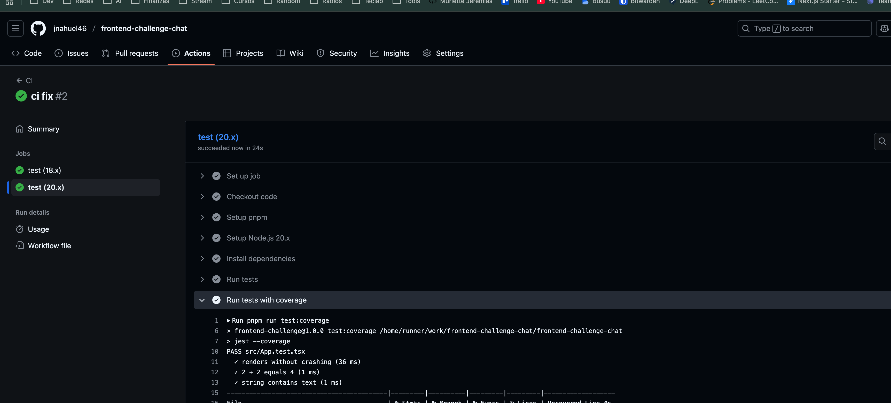
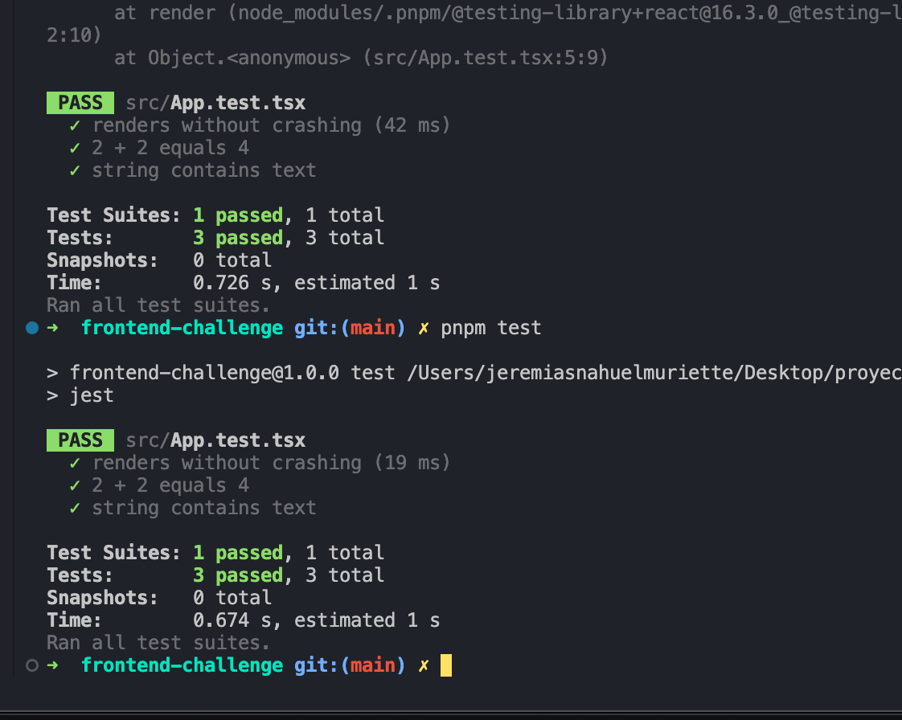

# How I Built
## Deploy URL https://frontend-challenge-chat.vercel.app/
## URL Repo https://github.com/jnahuel46/frontend-challenge-chat

## Time Breakdown

**About 3 hours total** (honestly could've been more if I kept tweaking things...)

- **Late night coding: 2 hours** - Getting the basics working, fighting with CSS as usual
- **Morning coffee session: 1 hour** - Making it pretty with design tokens and writing docs

## What Actually Got Done

### The Good Stuff ✅

- **UI that doesn't suck**: Tried my best to match the Figma design pixel-perfect (well, close enough)
- **Two modes**: Landing page where you pick between chat or voice - seemed obvious but wasn't in the original design
- **Speaking indicators**: You can actually tell when someone's talking vs when Iris is responding
- **Mood/tone indicators**: Visual mood representation with color-coded icons that show conversation emotional context
- **Message actions**: Retry/cancel icons for message interaction (currently show "Work in progress" tooltip)
- **Works on your phone**: Started mobile-first
- **Design tokens**: Finally organized all those random colors and sizes that were scattered everywhere
- **State management**: Zustand, much more simpler and faster
- **A11y stuff**: Added the ARIA labels and keyboard nav that we always forget about
- **GitHub Action**: Thinging on the future to have a great pipeline running automated tests
- 
### Tech Choices

- **React + TypeScript**: Because types save lives
- **SCSS Modules**: Keeps styles simplers (with more time ill be use tailwind)
- **Atomic Design**: To have an organized project
- **Custom animations**: focus on the orbs (with more time ill be use a library)
- **Mobile-first**: Based on the assumption that will be used for more users in mobile
- **Jest**: Basic test implentation, with more time i could complete a 100% coverage
- 

## Problems I Had to Solve

### Making Orbs Actually Look Like They're Breathing

Turns out smooth animations are harder than they look. Had to mess around with CSS keyframes until they felt natural - scale, rotation, the works. The speaking states needed to override the idle breathing without looking janky.

### Implementing Mood/Tone Visual Indicators

Challenge requirement was to "creatively interpret and display conversation mood/tone changes." Solved this by creating a MoodIndicator component with 5 mood states (positive, negative, excited, thoughtful, neutral) using color-coded circular icons. Each mood has its own visual representation and smooth animations.

### Adding Message Interaction Controls

Created retry/cancel icons for each message with "Work in progress" tooltips. These provide the foundation for future message management features - retry failed messages, cancel pending ones. Used consistent teal theming to match the app's visual language.

### Navigation That works well on Both Desktop and Mobile

One navigation component, two completely different layouts. Bottom bar on mobile (because thumbs), sidebar on desktop (because screen real estate). CSS media queries are still magic to me sometimes.

### Not Copy-Pasting the Same Colors Everywhere

Created a design token system because I was tired of seeing `#18181B` scattered across 47 different files. Now it's `$color-zinc-dark` and my future self will thank me.

## What I'd Do With More Time (aka the TODO wishlist)

### Actually Test This Thing

Would love to add proper tests because "it works on my machine" isn't good enough. Jest + React Testing Library for the components, some integration tests to make sure clicking buttons actually does stuff, and maybe even visual regression tests so I stop breaking the design by accident.

### Hook It Up to Real AI (6-8 hours)

Right now it's all fake responses. Would be cool to integrate OpenAI's API with actual streaming, add voice-to-text with the Web Speech API, and build proper error handling for when the internet inevitably fails.

### Make the Animations Actually Good (3-4 hours)

My CSS animations are okay but Framer Motion would make them buttery smooth. Plus all those micro-interactions that make an app feel polished - button hover states, loading animations, orbs that react to actual voice input.

### Add All the Features I Didn't Have Time For (5-7 hours)

- Message search (because scrolling through chat history sucks)
- Edit/delete messages (for when you say something dumb)
- File uploads (images, documents, whatever)
- Proper theme switching (not just the placeholder I have now)
- Keyboard shortcuts (for the power users)
- **Message retry/cancel functionality**: Currently shows placeholder tooltips, would implement actual retry logic and message cancellation
- **Advanced mood detection**: Could integrate with sentiment analysis APIs for more accurate mood detection
- **Mood-based animations**: Different orb animations based on conversation mood/tone

### Clean Up My Code (2-3 hours)

Error boundaries so the whole app doesn't crash when something breaks, extract some custom hooks to make things reusable, and optimize performance because I definitely forgot some React.memo's in there.

## Key Assumptions I Made

### Landing Page

The Figma didn't show how users would pick between chat and voice modes, so I added a welcome screen. Seemed like the obvious UX flow - let people choose their preferred interaction style upfront.

### Voice Mode Design

Had to interpret what "voice interaction" meant. Went with dual orbs (AI + user) with microphone controls and visual feedback. The breathing animations make it feel alive, speaking states show who's talking.

### Mobile Experience

Assumed most people would use this on mobile, so designed for that first. Bottom navigation for thumbs, sidebar for desktop when you have more screen space.

### Visual Chat States

Made it super clear when someone's typing vs when Iris is responding. Added the little orb in the chat header and status indicators because context is everything.

### Theme System

Assumed dark mode was primary (looks cooler, easier on the eyes), but built the token system to support light mode later.

## How to Run

```bash
# Clone the repo
git clone [your-repo-url]

# Install dependencies (using pnpm because it's faster)
pnpm install

# Start the dev server
pnpm run dev

# Open http://localhost:5173 in your browser
```

That's it! Should work on any modern browser. Built with Vite so hot reload is lightning fast.

## Technical Decisions Rationale

### PNPM over npm/yarn

- **30% faster installs** and better disk space efficiency
- **Strict dependency resolution** preventing phantom dependencies
- **Better monorepo support** for future scaling

### Zustand over Redux/Context

- **95% less boilerplate** compared to Redux Toolkit
- **Better TypeScript integration** with minimal setup
- **Perfect scope** for this app's state complexity

### SCSS Modules over Tailwind

- **Design token system** - centralized values for consistency
- **Component encapsulation** - scoped styles prevent conflicts
- **Better animation control** - complex keyframes and transitions
- **Theme system flexibility** - CSS custom properties integration

### Custom Components over Libraries

- **Design control** - exact match to Figma specifications
- **Bundle size** - only include what we need
- **Animation precision** - custom orb behaviors and states
- **Learning opportunity** - deeper understanding of implementation

## Reflection

The 3-hour constraint forced prioritization of core features over polish. The architecture decisions (Zustand, SCSS Modules, Atomic Design) proved effective for rapid development while maintaining code quality.

The design token system was particularly valuable - it enabled consistent styling across components and made the codebase more maintainable. The mobile-first responsive approach worked well with the component architecture.

Given more time, the focus would be on real AI integration, comprehensive testing, and animation polish to create a production-ready chat interface.
